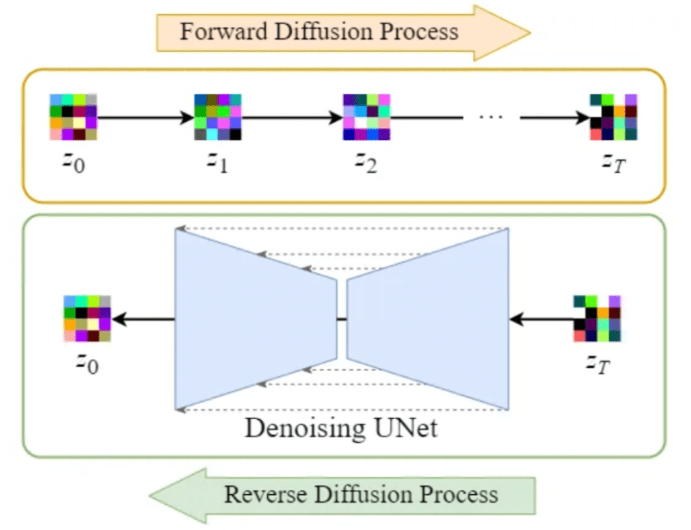

# Latent Diffusion Model Implementation

Latent Diffusion Model Implementation is a Python project exploring the implementation of a latent diffusion model using a variational autoencoder (VAE) and a conditional U-Net. It currently targets the MNIST dataset, but the architecture and training pipeline are intentionally dataset-agnostic and can scale to larger and more complex image domains with minimal changes.

## Overview of Latent Diffusion and Their Benefits
Latent diffusion models are a class of generative models that combine the mathematical rigor of diffusion processes with the efficiency of learned latent representations. Instead of gradually corrupting and denoising high-dimensional pixel data directly, these models first compress images into a lower-dimensional latent space using a variational autoencoder. The diffusion process—adding and then removing noise step by step—is carried out in this compact representation, and only once denoising is complete is the result decoded back into pixel space.


[*Original forward and reverse diffusion process in the high-dimensional pixel data*](https://cvpr2022-tutorial-diffusion-models.github.io/)



[*Overview of the Stable Diffusion model within the latent space*](https://medium.com/@steinsfu/stable-diffusion-clearly-explained-ed008044e07e)

This shift from pixel to latent space is what sets them apart from original diffusion models. Traditional diffusion approaches work on every pixel and color channel, which makes sampling and training both computationally intensive and memory-hungry, especially at high resolutions. By contrast, latent diffusion models exploit the fact that most of an image’s semantic content can be captured in a much smaller latent code, so the noise scheduling and neural denoiser operate on far fewer dimensions.

The benefits are twofold. First, working in a compressed space dramatically reduces the computational load and memory footprint, enabling faster sampling and scaling to larger images. Second, the learned latent representation often smooths out irrelevant pixel-level details, allowing the model to focus on semantically meaningful structure; this not only speeds up convergence during training but also often improves the visual quality of generations.

## Choosing Cosine over Linear Scheduler


[*Linear and Cosine schedulers, extracted from the Improved DDPM paper*](https://arxiv.org/abs/2102.09672)

Schedulers control how much noise is added at each diffusion step. The original DDPM paper uses a linear schedule, increasing βₜ steadily from 0.0001 to 0.02 over T timesteps. The Improved DDPM paper instead adopts a cosine schedule, which eases noise in more gradually: early steps add very little disturbance and later steps ramp up more gently. This smoother progression preserves more of the image’s structure for longer, preventing the abrupt information loss seen with a linear schedule and giving the model clearer signals to learn from in the later denoising stages.

## Project Features
- **Modular Architecture** – separate training routines for VAE and U-Net components built on top of Hugging Face Diffusers.
- **Dataset Agnostic Pipeline** – although the repository demonstrates MNIST, the data loaders and model design can be easily extended to other datasets, retaining most of the training logic from this experiment.
- **Configurable Training** – hyperparameters (batch size, learning rates, epochs, etc.) are managed via `config.yaml` for reproducible experiments.
- **Efficient & Stable Training** – leverages `Accelerate` for device management and distributed training, cosine learning rate schedules, and EMA tracking. Added gradient clipping.
- **Visualization Utilities** – automatic saving of reconstruction and generation plots for monitoring model performance.
- **Gradio App** – ready-to-deploy web app for interactive predictions. Hosted on [Huggingface Spaces](https://huggingface.co/spaces/codinglabsong/latent-diffuser-model-experiment-hf-mnist).
- **Developer Tools & CI** – Linting with ruff and black, unit tests with pytest, end‐to‐end smoke tests in GitHub Actions.

## Installation

1. Clone this repository and install the core dependencies:

    ```bash
    pip install -r requirements.txt
    ```

2. (Optional) Install development tools for linting and testing:

    ```bash
    pip install -r requirements-dev.txt
    pre-commit install
    ```

3. Install the package itself:

    ```bash
    pip install -e .
    ```

## Training

Use the provided helper script to train both the VAE and U-Net components:

```bash
bash scripts/run_train.sh
```

Configuration values can be adjusted in `config.yaml`.

## Inference

Generate samples with the trained models:

```bash
bash scripts/run_inference.sh
```

The script will load the VAE and EMA-smoothed U-Net weights and produce images stored under `plots/unet/`. The last epoch is the generated images for inference.

## Data Preprocessing

- Convert images to tensors and normalize to `[-1, 1]`.
- Resize images to `config.img_size` (default `32x32`).
- Additional preprocessing steps can be added in `ldm/data.py` when targeting other datasets.

## Results
### Example Outputs & Notes
**U-Net Epoch 1**


> The diffuser model is still grasping the structure of the numbers given a class embedding (between 0 - 9) that is chosen by the user.

**U-Net Epoch 15**


> Although the model is having a better understanding of the structures, we can see that it struggles with numbers that are similar to each other. Here, the generated image of the class embedding of 7 turns out to be 9, which is incorrect.

**U-Net Epoch 45**


> We can see that the numbers are either incomplete or too blurry, showing that the model needs further training.

**U-Net Epoch 59**


> We have sharper images that resemble the MNIST dataset, although these are completely new generations from the model.

**VAE Epoch 50**


> Instead of the classic diffuser models which apply the U-Net on each pixel of the image, latent diffusers first encode the image to a more compact latent output. Since the size is much smaller compared to the original image, training the U-Net on the latent space is significantly more efficient by saving compute and time.

### Considerations for Improvements

- Train on higher resolution or more diverse datasets.
- Experiment with deeper VAE/U-Net architectures or additional conditioning signals.
- Integrate more advanced schedulers or guidance techniques.

## Running the Gradio Inference App
This project includes an interactive Gradio app for making predictions with the trained model.

1. **Obtain the Trained Model:**
    - Ensure that a trained model directory (`models/vae.pth` and `models/ema-unet.pth`) is available in the project root.
    - If you trained the model yourself, it should be saved automatically in the project root.
    - Otherwise, you can download it from [Releases](https://github.com/codinglabsong/ldm-hf/releases/tag/v1.0.0) and add it in the project root.

2. **Run the App Locally:**
    ```bash
    python app.py
    ```
    - Visit the printed URL (e.g., `http://127.0.0.1:7860`) to interact with the model.

> You can also access the hosted demo on [Huggingface Spaces](https://huggingface.co/spaces/codinglabsong/latent-diffuser-model-experiment-hf-mnist)


## Testing

Run the unit test suite with:

```bash
pytest
```

## Repository Structure

- `src/ldm/` – source code for models, training, inference, and utilities.
- `scripts/` – shell scripts for training and inference.
- `tests/` – unit tests verifying data loaders, models, and utilities.
- `config.yaml` – experiment configuration.
- `ETHICS.md`, `MODEL_CARD.md` – documentation about ethical considerations and model details.

## Requirements

- Python >= 3.10
- PyTorch, diffusers, and other dependencies specified in `requirements.txt`

## Contributing

Contributions are welcome! Please open an issue or submit a pull request.

## Acknowledgements

- [Hugging Face Diffusers](https://github.com/huggingface/diffusers)
- [MNIST Dataset](http://yann.lecun.com/exdb/mnist/)
- [High-Resolution Image Synthesis with Latent Diffusion Models Research Paper](https://arxiv.org/abs/2112.10752)

## License

This project is licensed under the [MIT License](LICENSE).
